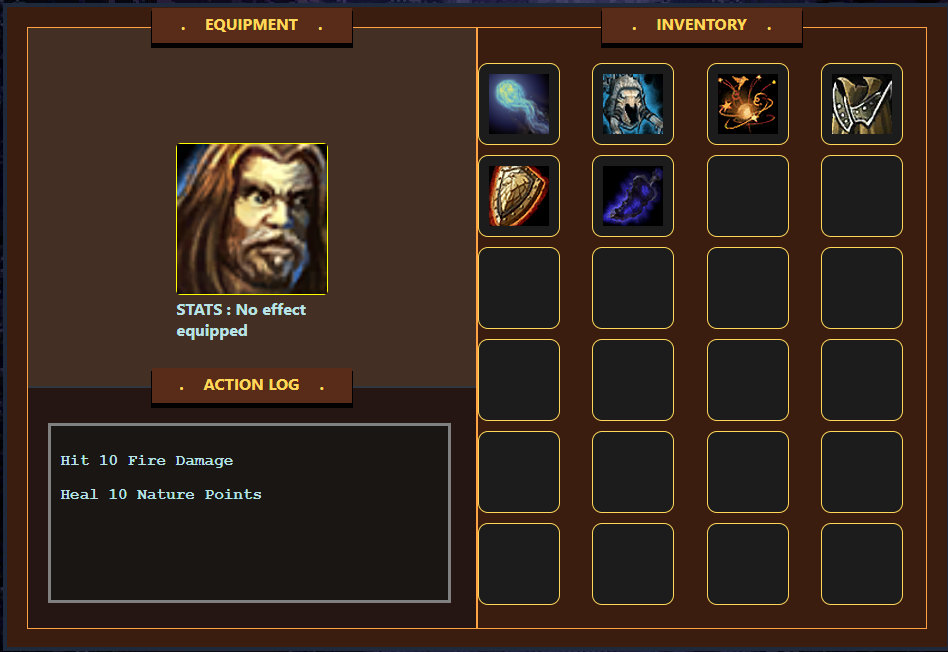

## Basic RPG Inventory

###[RPG Inventory ](https://nrobert-dev.github.io/typescript-rpg-inventory/)

I'm a heavy RPG fan. I was looking into Typescript and decided to test out
some features of the language by implementing a simple inventory management UI.

## Implemented Features

* Basic RPG Inventory look
* Equipabble items with stats
* Basic character with changeable stats based on the equipped items
* Able to move items around the inventory
* Item tooltips on hover
* Scrolls which can be cast

